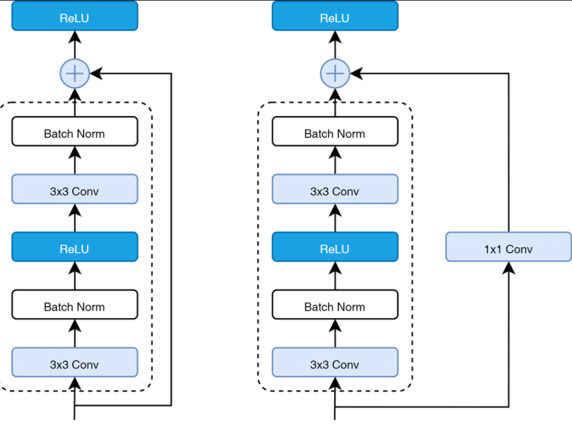
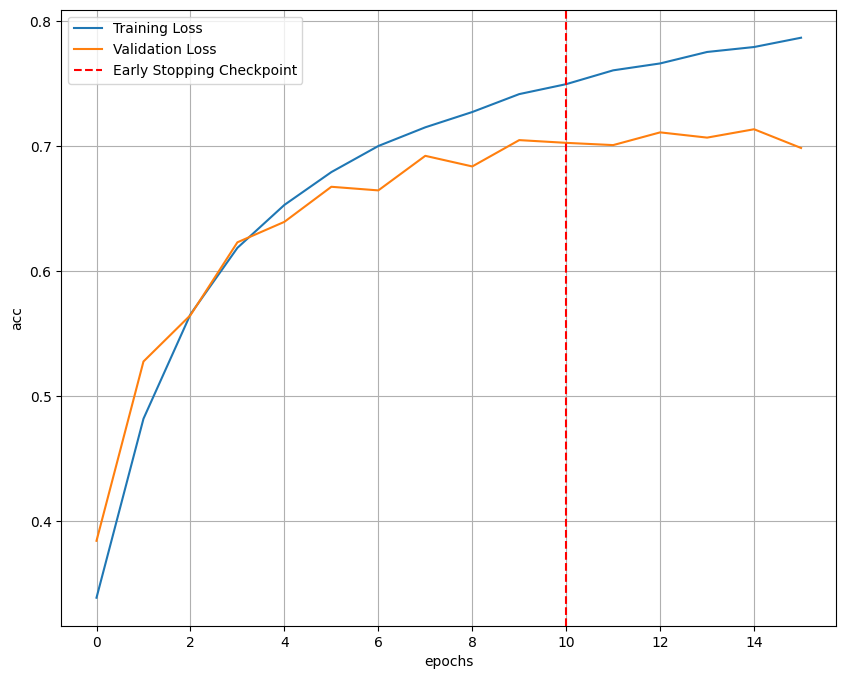
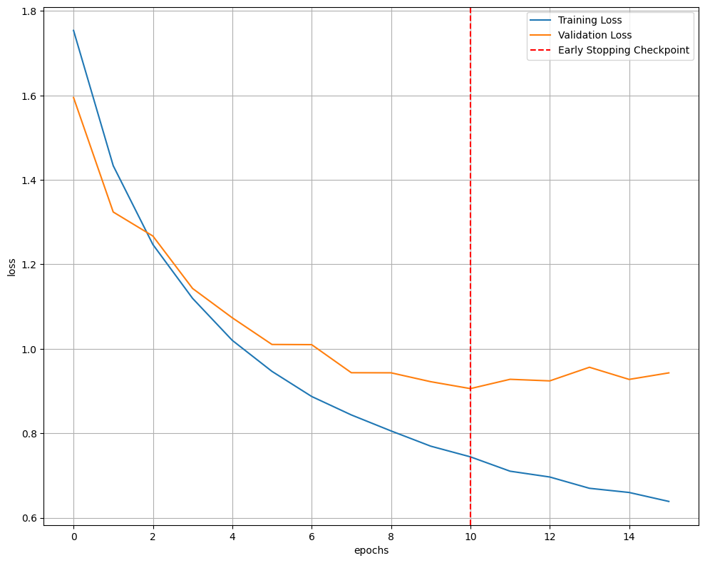

# ResNet-18

Model ResNet-18 được xây dựng trên cấu trúc Block

    

Sử dụng model kết hợp CrossEntropy và SGD(lr = 0.01, momentum = 0.9) cho ra kết quả chưa được tốt. Model hội tụ sau 12 epochs:
Train Loss: 0.773, Train Acc: 0.74, Valid Loss: 0.930, Valid Acc: 0.70

    

**Loss** trên cả tập `train` và `test` đều hội tụ nhanh sau epoch 10. Từ epoch 10 loss trên tập `valid` bắt đầu đi ngang nhưng trên tập `train` vẫn tiếp tục giảm.

    

Độ chính xác của mô hình trên tập `train` chưa được cao (0.8) và ở tập `valid`(0.7). Có độ chênh lệch lớn `accuracy` trên 2 tập `train` và `valid`.(Model vẫn chưa khái quát được dữ liệu chưa nhìn thấy - high variance)

## Regularization

Mô hình khi kết hợp với regularization - SGD(lr=0.001, weight_decay=5e-4) ở epoch thứ 10 mặc dù lr thấp hơn rất nhiều nhưng hội tụ nhanh.

    

Mô hình hội tụ nhanh hơn và độ chênh lệch giữa `trainset` và `validset` nhỏ hơn đáng kể `(giảm được variance)`

    

=======
# ResNet-18

